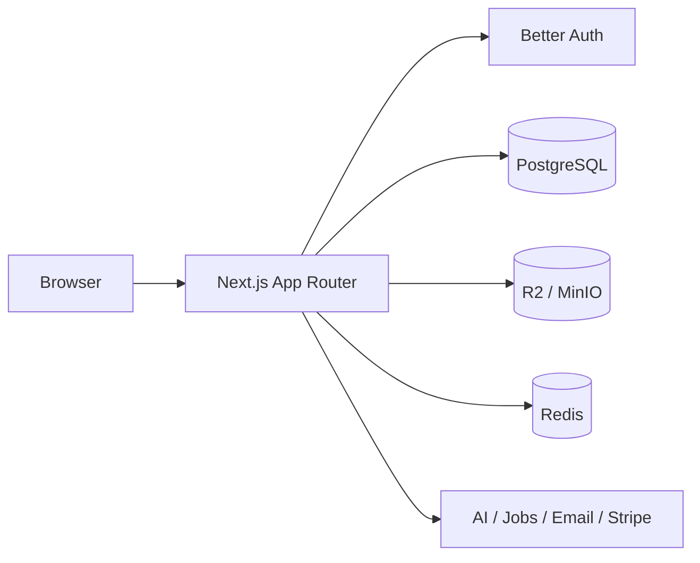

<div align="center">
  

  <h1>Align</h1>

  <p><strong>Evidence-led CV analysis and UK career intelligence.</strong></p>
  <p>Build a truthful career profile, understand role fit, and create stronger applications without inventing experience.</p>

  <p>
    <a href="docs/PROJECT_STATUS.md"></a>
    <a href="https://nextjs.org/"></a>
    <a href="https://react.dev/"></a>
    <a href="https://www.typescriptlang.org/"></a>
    <a href="https://www.prisma.io/"></a>
    <a href="https://vitest.dev/"></a>
  </p>

  <p>
    <a href="#what-align-does">Product</a> &middot;
    <a href="docs/ARCHITECTURE.md">Architecture</a> &middot;
    <a href="docs/DEPLOYMENT.md">Deployment</a> &middot;
    <a href="docs/PROJECT_STATUS.md">Project status</a> &middot;
    <a href="DESIGN.md">Design system</a>
  </p>
</div>


## What Align does

Align combines a candidate's real evidence with practical UK employability context. It is designed for international and UK-based early-career job seekers who need useful application guidance without fabricated claims or false certainty.

| Area | Capability |
| --- | --- |
| Career profile | Manual or CV-assisted onboarding, structured evidence, practical constraints, multiple career directions, and resumable progress |
| ATS analysis | Deterministic document checks plus schema-constrained AI feedback, versioned results, and retained history |
| Job matching | Evidence-aware role comparison, requirement mapping, skill gaps, scoring ledger, and rewrite strategy |
| CV generation | Profile-backed DOCX generation, provenance validation, bounded repair, private storage, and downloads |
| Job intelligence | Adzuna, Reed, and Jooble search; saved jobs; company records; descriptions; and matching hand-off |
| UK sponsorship | GOV.UK sponsor-register discovery, indexed organisation resolution, and clearly qualified evidence |
| Account lifecycle | Credential and Google auth, verification, lifecycle email, password/session controls, billing, and deliberate deletion |
| Commercial controls | Stripe billing, central entitlements, quota reservations, retention limits, and usage presentation |

Align does not promise employment, sponsorship, visa eligibility, salary outcomes, or ATS success. Provider data and AI output are treated as inputs to transparent product decisions, not as authority.

## Architecture



The UI is organised by user journey under `src/features`. Cross-feature policies, provider adapters, storage, billing, entitlements, and persistence boundaries live under `src/shared`. PostgreSQL is the durable source of truth; Redis is used only for distributed protection and disposable job-search state.

Read the full [architecture guide](docs/ARCHITECTURE.md) for route boundaries, data flows, infrastructure, and security invariants.

## Technology

- Next.js 16.2 App Router and React 19.2
- TypeScript, Tailwind CSS 4, Framer Motion, and Recharts
- PostgreSQL with Prisma 7.8
- Better Auth with credential and Google OAuth flows
- Google Gemini with Groq fallback
- S3-compatible object storage: MinIO locally and Cloudflare R2 in production
- Upstash REST rate limiting and Redis job-board caching
- Resend lifecycle email and Stripe billing
- Vitest, Testing Library, and opt-in backing-service integration tests

## Local development

### Prerequisites

- Node.js 20 or later
- Docker with Compose

### Install and configure

```bash
git clone https://github.com/vyndra-tech/align.git
cd align
npm install
```

Copy `.env.example` to `.env.local`, then add any provider keys needed for the flow you are developing. Local Postgres, MinIO, and Redis values are already documented in the example.

```bash
npm run dev:up
npm run db:setup
npm run dev
```

The application runs at `http://localhost:3000`. MinIO's local console is available at `http://localhost:9001` with the development credentials from `.env.example`.

### Useful commands

| Command | Purpose |
| --- | --- |
| `npm run dev` | Start the Next.js development server |
| `npm run dev:up` | Start Postgres, MinIO, bucket initialisation, and Redis |
| `npm run dev:down` | Stop local backing services without deleting their data |
| `npm run dev:nuke` | Delete local backing-service volumes and recreate from a clean state |
| `npm run db:deploy` | Apply committed Prisma migrations |
| `npm run db:seed` | Seed local development data |
| `npm test` | Run the Vitest suite |
| `npm run typecheck` | Run TypeScript without emitting files |
| `npm run build` | Produce a production Next.js build |
| `npm run check:env` | Validate environment names, shapes, and combinations |
| `npm run check:env:live` | Probe storage credentials, signing, and bucket privacy |

`DATABASE_URL` must point at local Postgres before running destructive development commands. The repository includes a guard that refuses local reset operations when a production environment is detected.

## Environment groups

The complete production contract lives in [docs/DEPLOYMENT.md](docs/DEPLOYMENT.md). At a glance:

- Database: `DATABASE_URL`, `DIRECT_URL`
- Auth: `BETTER_AUTH_SECRET`, `BETTER_AUTH_URL`, optional Google credentials
- Email: `RESEND_API_KEY`, `AUTH_EMAIL_FROM`
- AI: `GEMINI_API_KEY`, recommended `GROQ_API_KEY`
- Protection/cache: Upstash REST credentials and a separate `REDIS_URL`
- Storage: S3 endpoint, credentials, three buckets, and the public avatar base URL
- Jobs: Adzuna, Reed, and Jooble credentials
- Billing: Stripe secret, webhook secret, publishable key, price ID, and public app URL

Never commit `.env.local`, production secrets, downloaded ESCO datasets, CV fixtures containing personal data, or generated development logs.

## Repository map

```text
src/app/                 Next.js pages, layouts, and route handlers
src/features/            User-journey UI and client/server compositions
src/shared/              Domain services, policies, adapters, and UI primitives
prisma/                  Schema and ordered migrations
scripts/                 Environment, import, audit, and maintenance commands
data/sponsors/           Pinned sponsor-register fallback data
docs/                    Architecture, deployment, status, and runbooks
docker/                  Local backing-service initialisation
```

## Product integrity

- User evidence remains authoritative; AI may organise or rewrite it but may not invent it.
- Raw CVs and generated documents stay in private buckets and use short-lived signed URLs.
- Provider-backed work requires a verified identity, rate-limit approval, and entitlement approval.
- Billing access is granted only after verified webhook convergence.
- Sponsorship evidence is dated and qualified, never presented as a guarantee.
- Accessibility, reduced motion, keyboard use, clear errors, and non-alarmist language are product requirements.

## Documentation

- [Current project status](docs/PROJECT_STATUS.md)
- [System architecture](docs/ARCHITECTURE.md)
- [Production deployment](docs/DEPLOYMENT.md)
- [Product principles](PRODUCT.md)
- [Design system](DESIGN.md)
- [Object-storage configuration](docs/deployment/object-storage.md)
- [Reservation and reliability smoke tests](docs/RESERVATION_SMOKE.md)
- [Golden CV review](docs/STAGE4_GOLDEN_CV_REVIEW.md)
- [ESCO skill taxonomy](docs/ESCO_SKILLS.md)
