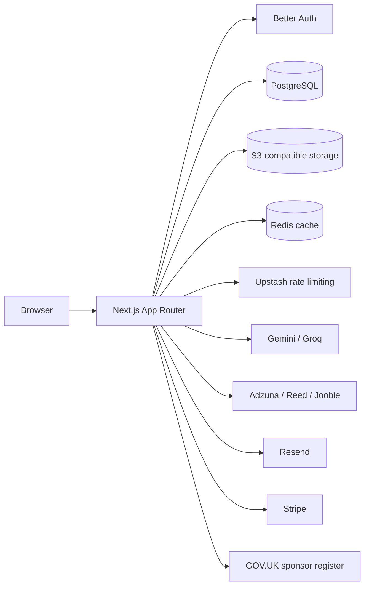
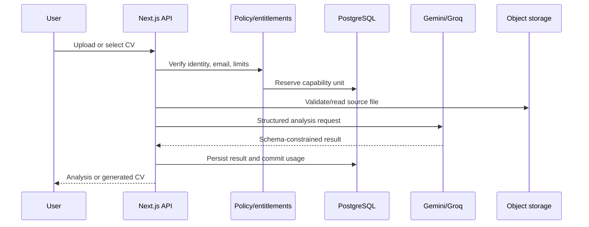

# Align architecture

This document describes the architecture implemented in the repository as of 20 September 2026. Dated audits, designs, and implementation plans under `docs/` and `docs/superpowers/` are historical records; this file is the current system reference.

## System at a glance

Align is a Next.js 16 application for evidence-led CV analysis and UK career intelligence. The browser uses App Router pages and route handlers. PostgreSQL is the durable source of truth, S3-compatible storage holds user files, Redis-backed services protect and accelerate requests, and external providers supply AI, job, email, identity, and billing capabilities.



## Application boundaries

### Routes and rendering

The route tree under `src/app` separates user journeys without duplicating domain logic:

- `(public)` contains the landing page, public ATS entry point, jobs, immigration, and trends pages.
- `(auth)` contains sign-up, sign-in, email verification, forgotten-password, and reset-password flows.
- `onboarding` owns manual and CV-assisted profile creation.
- `(dashboard)` contains the authenticated workspace, analysis history, CV import, job discovery, saved jobs, company intelligence, and matching.
- `(settings)` is an authenticated settings branch that remains reachable independently of onboarding completion. Account, billing, privacy controls, and security use the normal dashboard chrome.
- `api` exposes narrow HTTP boundaries for authentication, analyses, billing, CVs, jobs, profiles, storage, sponsorship, and account deletion.

Pages compose feature modules. They do not own provider credentials or persistence rules.

### Feature modules

`src/features` owns page-level user experiences:

- `auth` — authentication and account-lifecycle forms.
- `onboarding` — resumable manual and CV-import onboarding.
- `dashboard` — workspace shell, profile management, analysis history, and billing presentation.
- `cv-analyzer` — ATS and job-match result experiences.
- `cv-rewrite` — evidence-aware CV generation and download flows.
- `jobs` and `job-board` — discovery, saved jobs, companies, and matching hand-off.
- `settings` — account, billing, security, sessions, and deliberate deletion UI.
- `landing-page` and `immigration` — public product and guidance experiences.

Feature modules may call route handlers or server actions. Provider SDK access, database transactions, and policy enforcement belong in shared server modules.

### Shared domain layer

`src/shared` holds cross-feature contracts and server-side boundaries:

- `lib` — Prisma, Better Auth, cache/storage clients, rate limiting, and runtime configuration.
- `services` — analysis, job discovery, sponsor resolution, CV import, profile evidence, and lifecycle orchestration.
- `billing` — provider-neutral offers, access resolution, Stripe adapter, webhook convergence, and portal/checkout operations.
- `entitlements` — plan capabilities, usage decisions, reservations, and limits.
- `account-deletion` — subscription-aware deletion policy and cleanup.
- `email` — branded lifecycle templates and Resend delivery.
- `policies`, `schemas`, and `types` — shared limits and contracts.
- `components` — reusable UI primitives rather than page-specific compositions.

## Core data flows

### Authentication and account lifecycle

Better Auth persists users, sessions, accounts, and verification records through Prisma. Credential sign-up sends a verification email. Successful verification sends one welcome message using a PostgreSQL advisory lock and a Resend idempotency key. Google OAuth uses the same welcome service.

Provider-backed work requires a verified email. Password resets revoke existing sessions; password changes and session revocation are exposed from Security settings. Account deletion requires explicit confirmation, checks current billing access, removes owned files through the storage abstraction, and then delegates identity deletion to Better Auth. Active paid access blocks deletion; it is never silently cancelled.

### CV analysis and generation



Analysis domains are stored separately so ATS analysis and job matching retain their own inputs, versions, and result contracts. Generation uses canonical profile evidence and provenance checks; unsupported claims are rejected or deterministically repaired within bounded policy.

Capability reservations protect metered work from double charging. An operation is reserved before provider work, committed after durable success, and released or expires after failure. Request idempotency and PostgreSQL locks handle retries and concurrency.

### Career profiles and evidence

A user can own multiple career profiles subject to plan limits. Profiles contain identity, practical constraints, experience, projects, education, skills, certifications, licences, registrations, languages, training, volunteering, and other evidence. Imported CV entities remain proposals until the user confirms them.

Profile-evidence approvals and snapshots preserve what the user authorised for a specific application context. ESCO is an optional, locally imported suggestion taxonomy; it is not a runtime dependency and never asserts that a user owns a skill.

### Job discovery and sponsor intelligence

The job board normalises Adzuna, Reed, and Jooble results into provider-neutral records. Provider results and merged search sessions use Redis when configured. Durable job snapshots, saved jobs, employers, descriptions, sponsor history, and match requests live in PostgreSQL.

Sponsor matching uses the GOV.UK register, indexed name resolution, and persisted evidence. The UI presents sponsorship evidence as guidance, never as a guarantee. A selected snapshot can be prepared for an evidence-aware match against a user-owned profile.

### Billing and entitlements

Stripe is the launch billing provider, but application services depend on provider-neutral billing contracts. The client submits an allow-listed offer identifier; the server resolves the configured Stripe price. Checkout never grants access directly. Only signed webhook events converge purchases and effective access in PostgreSQL.

The entitlement registry is authoritative for plan limits, retention, and metered capabilities. UI plan cards and usage meters consume the same decisions used by server enforcement.

## Persistence and infrastructure

### PostgreSQL

Prisma models cover identity, profiles/evidence, analyses, CV imports and revisions, job intelligence, billing, entitlements, reservations, and onboarding. The application uses pooled `DATABASE_URL`; Prisma migrations use `DIRECT_URL` when the provider supplies a pooler.

Database transactions and advisory locks protect concurrency-sensitive limits, welcome delivery, saved jobs, profile creation, upload finalisation, billing convergence, and usage reservations.

### Object storage

The storage adapter speaks the S3 API and supports MinIO locally and Cloudflare R2 in production:

- `S3_BUCKET_UPLOADS` — private raw CV uploads.
- `S3_BUCKET_REWRITES` — private generated CVs.
- `S3_BUCKET_AVATARS` — public-read avatars only.

Browser CV uploads use short-lived presigned PUT URLs. The server validates size, type signatures, ownership, and upload-intent state before accepting a stored CV record.

### Redis services

Two deliberately separate Redis configurations exist:

- `UPSTASH_REDIS_REST_URL` and `UPSTASH_REDIS_REST_TOKEN` back distributed rate limits. They are required in production.
- `REDIS_URL` is a `redis://` or `rediss://` connection for job-board caching, shared search sessions, and refresh locks.

They are not interchangeable. PostgreSQL remains the source of truth; Redis data is disposable.

## Security and reliability invariants

- Secrets remain server-only; only variables prefixed with `NEXT_PUBLIC_` may reach the browser.
- Raw CVs and generated documents are private and accessed through short-lived signed URLs.
- Provider-backed work requires authentication, verified email, rate-limit approval, and entitlement approval.
- Upload metadata supplied by a browser is never trusted without server-side object validation.
- Stripe signatures are verified against the raw request body before processing.
- Account deletion derives identity from the session and cannot cancel an active subscription implicitly.
- AI output is parsed into explicit schemas and checked against user-approved evidence.
- External-provider failures use stable application errors and do not mutate durable state prematurely.

## Testing strategy

Vitest covers pure domain logic, components, route handlers, provider adapters, and mocked failure modes. PostgreSQL/MinIO/Redis integration suites opt in when local backing services are available. Golden CV fixtures exercise evidence safety and deterministic document generation.

Primary verification commands:

```bash
npm test
npm run typecheck
npm run build
npm run check:env
npm run check:env:live
```

See [Deployment](./DEPLOYMENT.md), [Project status](./PROJECT_STATUS.md), and the [reservation smoke checklist](./RESERVATION_SMOKE.md) for operational verification.
