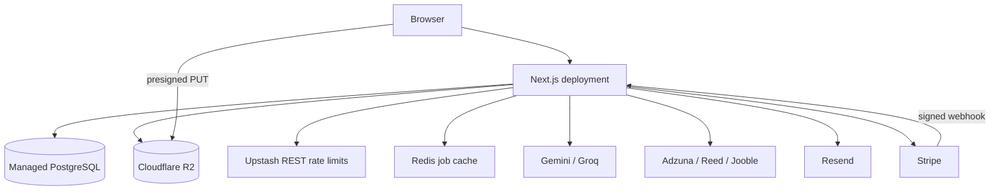

# Production deployment

Align's production contract is configuration-driven: provision the backing services, set the environment variables, apply migrations, deploy the same application build, and run the live verification gates.

This guide assumes `https://align.vyndra.tech`. Replace that origin consistently if production uses another domain.

## Production topology



## Environment variables

### Application and database

| Variable | Requirement | Production value |
| --- | --- | --- |
| `NEXT_PUBLIC_APP_URL` | Required for complete billing/email URLs | Public HTTPS origin, without a trailing slash |
| `DATABASE_URL` | Required | Pooled PostgreSQL connection used by the running app |
| `DIRECT_URL` | Required when the provider uses a pooler | Unpooled connection used by Prisma Migrate |

For Neon, `DATABASE_URL` normally contains the `-pooler` host and `DIRECT_URL` uses the equivalent host without `-pooler`. Never run production migrations through a local or preview database by accident.

### Authentication and email

| Variable | Requirement | Notes |
| --- | --- | --- |
| `BETTER_AUTH_SECRET` | Required | Unique random value of at least 32 characters |
| `BETTER_AUTH_URL` | Required | The public HTTPS origin |
| `ADMIN_EMAILS` | Required to enable admin access | Comma-separated Better Auth account emails; server-only and case-insensitive |
| `GOOGLE_CLIENT_ID` | Required for Google sign-in | Google OAuth web client |
| `GOOGLE_CLIENT_SECRET` | Required for Google sign-in | Server-only OAuth secret |
| `RESEND_API_KEY` | Required in production | Server-only Resend API key |
| `AUTH_EMAIL_FROM` | Required in production | Verified sender, for example `Align <noreply@align.vyndra.tech>` |

Generate the auth secret with a cryptographically secure generator, for example:

```bash
openssl rand -base64 32
```

Admin routes reuse Better Auth sessions and then apply the `ADMIN_EMAILS` allowlist server-side in both page and data boundaries. Leaving the variable empty safely disables all admin access; changing to a persisted `USER | ADMIN` role later requires replacing only the central authorization policy.

Verify the sender domain in Resend and publish the SPF/DKIM records Resend supplies. Credential verification and password reset intentionally fail when email cannot be delivered; welcome, password-change, and deletion notices are best-effort after their primary action succeeds.

Configure Google OAuth with:

- Authorised origin: `https://align.vyndra.tech`
- Redirect URI: `https://align.vyndra.tech/api/auth/callback/google`

### AI providers

| Variable | Requirement | Notes |
| --- | --- | --- |
| `GEMINI_API_KEY` | Conditionally required | Primary provider when configured |
| `GROQ_API_KEY` | Conditionally required | Fallback after Gemini, or the sole provider when Gemini is unset |
| `AI_PROVIDER_TIMEOUT_MS` | Optional | Positive integer; defaults to `45000` |
| `AI_MAX_OUTPUT_TOKENS` | Optional | Positive integer; defaults to `8192` |

Production requires at least one supported AI provider: Gemini only, Groq only, and both are valid. When both are configured, the runtime tries Gemini then Groq. Configure both for graceful provider fallback and test both providers before launch.

### Rate limiting and caching

| Variable | Requirement | Notes |
| --- | --- | --- |
| `UPSTASH_REDIS_REST_URL` | Required in production | REST endpoint used only by distributed rate limits |
| `UPSTASH_REDIS_REST_TOKEN` | Required in production | Matching REST token |
| `REDIS_URL` | Required for full job-board behaviour | `redis://` or `rediss://` URL used by the job cache |

These are separate clients and are not interchangeable. In production, missing Upstash rate-limit credentials cause protected routes to return HTTP 503. Missing `REDIS_URL` is a supported degraded mode, but shared caching, refresh locks, and continuation sessions are unavailable; that is not a complete production configuration.

### Job and sponsor providers

| Variable | Requirement | Notes |
| --- | --- | --- |
| `ADZUNA_APP_ID` | Required for Adzuna | Must be paired with `ADZUNA_APP_KEY` |
| `ADZUNA_APP_KEY` | Required for Adzuna and trends | Must be paired with `ADZUNA_APP_ID` |
| `REED_API_KEY` | Required for Reed | That source is skipped when absent |
| `JOOBLE_API_KEY` | Required for Jooble | That source is skipped when absent |
| `GOVUK_SPONSOR_CSV_URL` | Optional override | The app otherwise discovers the current file and has a pinned fallback |

For full job-search coverage, configure all three commercial providers. Their failures are isolated so one provider does not invalidate successful results from another.

### Object storage

| Variable | Production value |
| --- | --- |
| `S3_ENDPOINT` | `https://<account-id>.r2.cloudflarestorage.com` |
| `S3_ACCESS_KEY_ID` | R2 API token access key |
| `S3_SECRET_ACCESS_KEY` | R2 API token secret |
| `S3_REGION` | `auto` |
| `S3_FORCE_PATH_STYLE` | `false` |
| `S3_BUCKET_UPLOADS` | `align-cv-uploads` |
| `S3_BUCKET_REWRITES` | `align-cv-rewrites` |
| `S3_BUCKET_AVATARS` | `align-users` |
| `S3_PUBLIC_URL_AVATARS` | Public avatar bucket hostname or custom CDN domain |

Create all three buckets before deployment:

1. Keep `align-cv-uploads` private. It contains raw CV PII and accepts browser uploads only through presigned PUT URLs.
2. Keep `align-cv-rewrites` private. It contains generated and tailored CVs.
3. Enable public reads only on `align-users`; browsers load avatar URLs directly.
4. Apply [`deployment/r2-uploads-cors.json`](./deployment/r2-uploads-cors.json) to the uploads bucket after confirming its allowed origin.
5. Run the live environment probe against the production credentials.

See [Object storage deployment](./deployment/object-storage.md) for the exact CORS command and privacy model.

### Stripe

| Variable | Requirement | Notes |
| --- | --- | --- |
| `STRIPE_SECRET_KEY` | Required for live billing | Server-only `sk_live_...` key |
| `STRIPE_WEBHOOK_SECRET` | Required for live billing | Signing secret for Align's webhook endpoint |
| `NEXT_PUBLIC_STRIPE_PUBLISHABLE_KEY` | Required for complete Stripe configuration | Must use the same live/test mode as the secret key |
| `STRIPE_PRO_MONTHLY_PRICE_ID` | Required for checkout | Server-owned `price_...` identifier |

Create the Pro Monthly recurring price in GBP and set the configured price ID. The application owns display metadata and currently presents the launch offer at £12.99 per month; the client never chooses an arbitrary provider price.

Create a Stripe webhook at:

```text
https://align.vyndra.tech/api/billing/webhook
```

Subscribe it to:

- `checkout.session.completed`
- `checkout.session.async_payment_succeeded`
- `checkout.session.async_payment_failed`
- `customer.subscription.created`
- `customer.subscription.updated`
- `customer.subscription.deleted`
- `invoice.paid`
- `invoice.payment_failed`
- `invoice.payment_action_required`

Checkout does not grant access. Effective plan access changes only after a signed webhook converges the purchase in PostgreSQL.

## Recommended production block

```dotenv
NEXT_PUBLIC_APP_URL=https://align.vyndra.tech
BETTER_AUTH_URL=https://align.vyndra.tech
BETTER_AUTH_SECRET=<random-secret>
ADMIN_EMAILS=<comma-separated-admin-emails>

DATABASE_URL=<pooled-postgres-url>
DIRECT_URL=<unpooled-postgres-url>

GOOGLE_CLIENT_ID=<google-client-id>
GOOGLE_CLIENT_SECRET=<google-client-secret>
RESEND_API_KEY=<resend-api-key>
AUTH_EMAIL_FROM=Align <noreply@align.vyndra.tech>

GEMINI_API_KEY=<gemini-api-key>
GROQ_API_KEY=<groq-api-key>

UPSTASH_REDIS_REST_URL=<upstash-rest-url>
UPSTASH_REDIS_REST_TOKEN=<upstash-rest-token>
REDIS_URL=<redis-or-rediss-url>

ADZUNA_APP_ID=<adzuna-id>
ADZUNA_APP_KEY=<adzuna-key>
REED_API_KEY=<reed-key>
JOOBLE_API_KEY=<jooble-key>

S3_ENDPOINT=https://<account-id>.r2.cloudflarestorage.com
S3_ACCESS_KEY_ID=<r2-access-key>
S3_SECRET_ACCESS_KEY=<r2-secret-key>
S3_REGION=auto
S3_FORCE_PATH_STYLE=false
S3_BUCKET_UPLOADS=align-cv-uploads
S3_BUCKET_REWRITES=align-cv-rewrites
S3_BUCKET_AVATARS=align-users
S3_PUBLIC_URL_AVATARS=https://avatars.align.vyndra.tech

STRIPE_SECRET_KEY=sk_live_...
STRIPE_WEBHOOK_SECRET=whsec_...
NEXT_PUBLIC_STRIPE_PUBLISHABLE_KEY=pk_live_...
STRIPE_PRO_MONTHLY_PRICE_ID=price_...
```

Do not store this block with real values in the repository. Use the deployment platform's encrypted environment settings. Variables prefixed with `NEXT_PUBLIC_` are compiled into browser bundles and require a rebuild when changed.

## Release procedure

### 1. Install and generate

```bash
npm ci
npx prisma generate
```

`npm ci` also runs the repository's Prisma generation hook, but the explicit command is useful in a dedicated build stage.

### 2. Validate configuration

Run with the production variables loaded:

```bash
npm run check:env
npm run check:env:live
```

`check:env:live` uploads a probe, signs and fetches it, confirms unsigned access is rejected by the private bucket, confirms avatars are publicly readable, and deletes the probe.

### 3. Apply migrations

Pull the production environment into the explicitly ignored temporary file, run
the guarded migration helper, and delete the file immediately afterward:

```bash
npx vercel env pull .env.production.local --environment=production
npm run db:migrate:production
node -e "require('node:fs').unlinkSync('.env.production.local')"
```

The helper requires both `DATABASE_URL` and `DIRECT_URL`, refuses loopback and
obvious local-development database hosts, runs `prisma migrate deploy`, and then
checks `prisma migrate status`. It does not print either URL. Delete
`.env.production.local` even when a migration attempt fails; the file is
gitignored as a second line of defense, but production secrets should not remain
on disk.

Run migrations before the new application build serves traffic.

### 4. Verify the build

```bash
npm test
npm run typecheck
npm run build
```

### 5. Deploy and smoke test

Verify at minimum:

- credential signup, verification email, login, forgot/reset password, and Google sign-in;
- onboarding through both manual and CV-import paths;
- direct CV upload, ATS analysis, job match, CV generation, and downloads;
- job search, continuation, save/unsave, company details, and sponsor evidence;
- Stripe checkout, webhook convergence, billing portal, and cancellation display;
- avatar upload, session revocation, and permitted/blocked account deletion;
- rate-limit behaviour and structured logs without secret or PII leakage.

Use [Reservation and reliability smoke tests](./RESERVATION_SMOKE.md) for metered operation checks.

## Rollback and operations

- Application rollback must remain compatible with already-applied migrations. Prefer forward fixes when a migration has reached production.
- Do not delete R2 objects or database rows as part of a normal code rollback.
- Redis can be emptied without durable data loss, but active job-search continuation tokens will expire.
- Rotate a leaked auth, provider, email, storage, or billing secret immediately and redeploy every runtime that held it.
- Preserve Stripe webhook delivery history and billing receipts while diagnosing access discrepancies.

## Local development contrast

Local development uses Docker Compose:

```bash
npm run dev:up
npm run db:setup
npm run dev
```

Local MinIO uses `S3_REGION=us-east-1` and `S3_FORCE_PATH_STYLE=true`; R2 uses `auto` and `false`. Local `DIRECT_URL` can be omitted because Docker Postgres is not behind a pooler.
